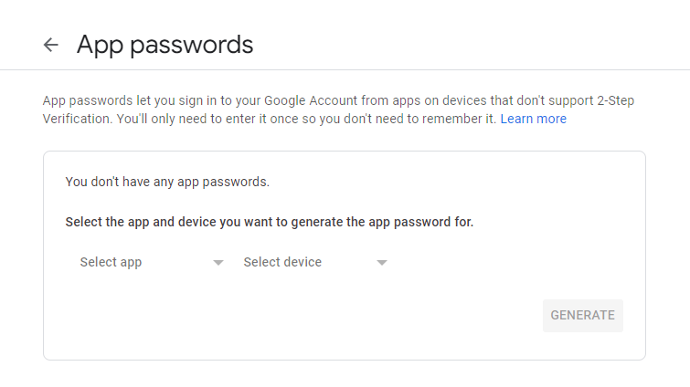
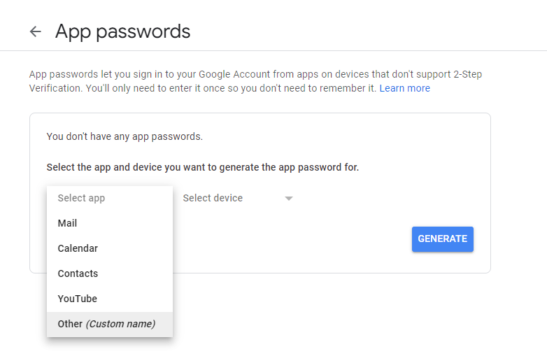
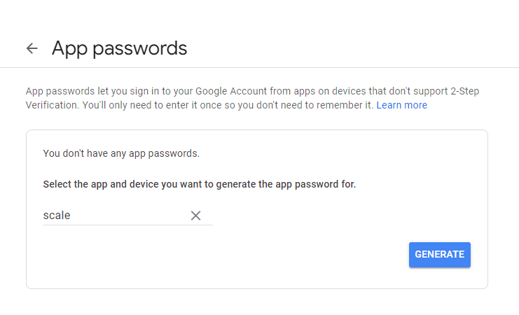
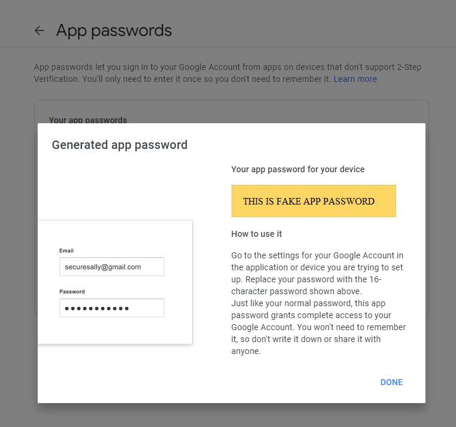

# App Passwords for Google

To use gmail for mail services and have 2-step or extra security enabled then create an app password by going to your google's [account security](https://myaccount.google.com/security) and then go to **2-Step Verification** scroll to the bottom of the page **App passwords**.

- Click `app` and select **Other**
  - Give it a name.
  - Generate password

:::note

The password will display with spaces, but its actually a single word password.

:::
