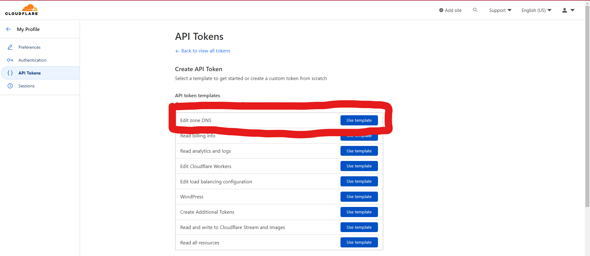
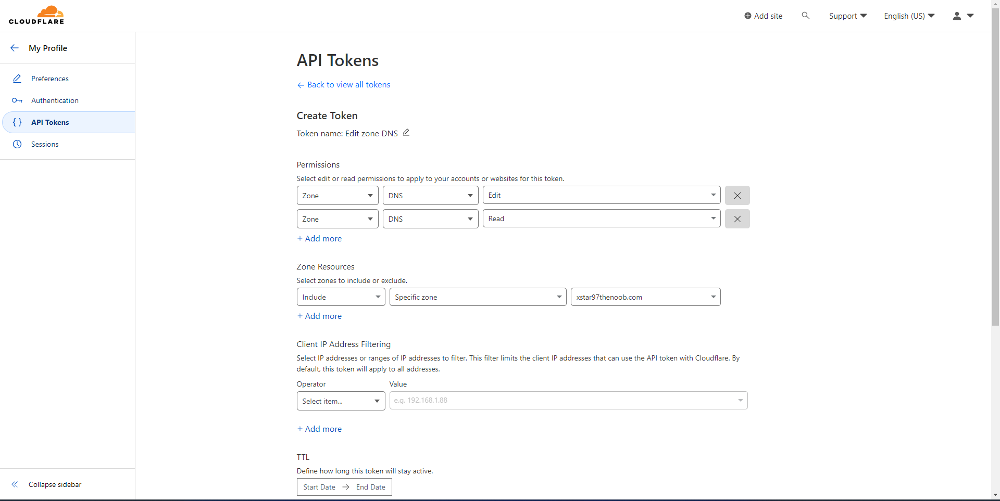

# CLoudFlare API Token

A simple guide to create custom cloudflare DNS API tokens for cert-manager, scale certs, and even DDNS.

Go to [CF API Tokens](https://dash.cloudflare.com/profile/api-tokens) and then `create a token`. Select the **edit zone DNS** template and create one for each root domain you want to add to scale's ACME section.

Under Create token, edit the name for this token and give it a good name for example `token-xstar97thenoob`.

Add both a **zone DNS** `edit` and `read` permissions.

Add a specific `domain` to the **Zone Resources**.

Continue to summary and then create token.
