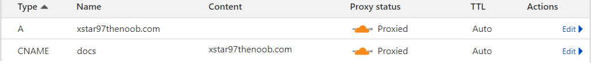

# DNS Records

Create a single A record that proxies your root domain then create CNAME records for each service you want to expose.

This has a simple advantage that you only need to update manually/API a single A record with a new public IP all the other CNAME records are just alias of the value from your A record.

