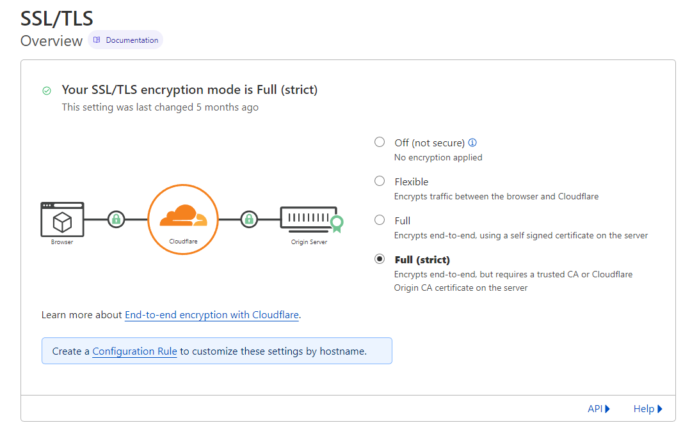
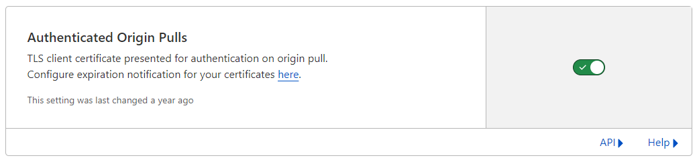

# SSL

If you plan to Proxy your domain at all, make sure to go to the SSL tab of the domain and set it to Full(strict).

## Authenticated Origin Pulls

A cool feature that Cloudflare offers is the option to receive emails whenever your cert(s) renew. Highly recommend enabling this feature.

To enable, go to your domain/website in [clouflare](https://dash.cloudflare.com) and then go to SSL/TLS sub menu -> Origin Server.

