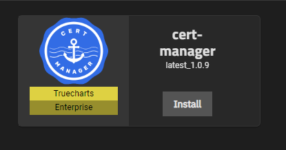
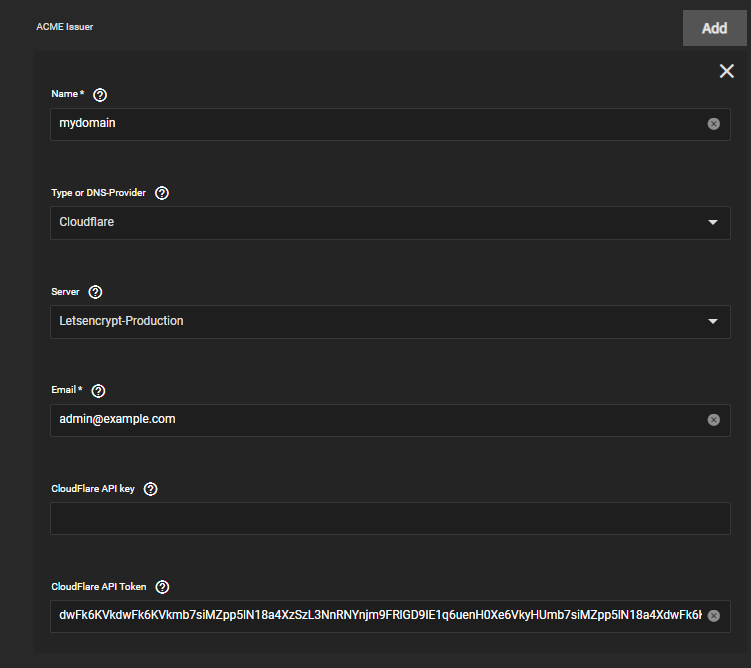
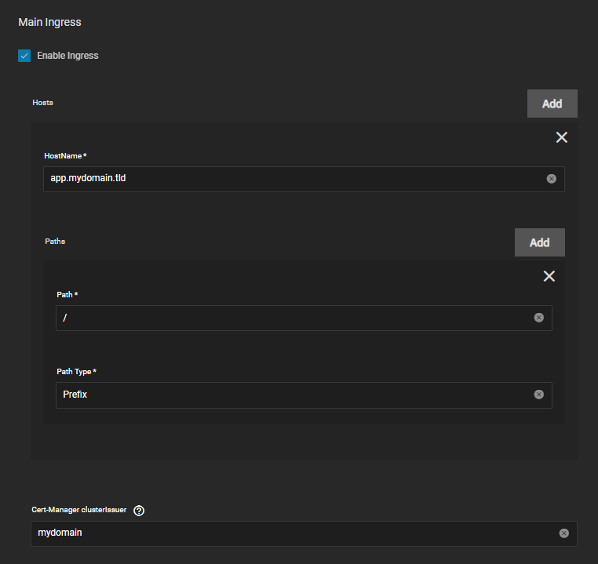
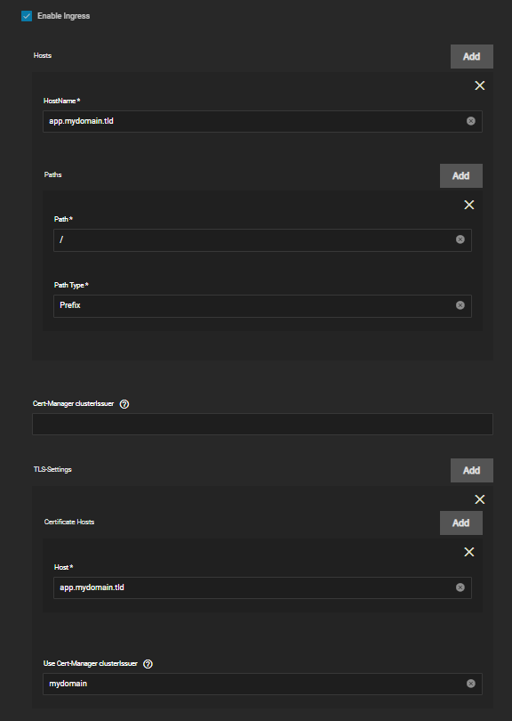

# Cert Manager How To Guide

This guide will walk you through on on how to setup Cert-Manager, A certificate management for Kubernetes.

> TrueChart's decided to implement the current industry leading certificates solution: Cert-Manager. It supports more forms of certificates, is faster to setup and is build by people that are actually specialized in certificate management.

You can read more [here](https://truecharts.org/news/breaking-enterprise-changes#cert-manager-certificates) from the amazing blogs that TrueCharts post <3.

Make sure to have the **enterprise** train enabled for the `truecharts-catalog` as discussed [here](https://truecharts.org/manual/SCALE/guides/getting-started#adding-truecharts).

Search for cert-manager in the `available apps` tab and click **install**.

## Cloudflare DNS-Provider

You can setup multiple domains with a single cert-manager app, all you have to do is either add the global API key (not recommended) or create multiple ACME Issuer for each domain if you created an API token, a guide [here](/docs/platforms/scale/networking/adding-letsencrypt-certificates.md#cloudflare).

- Give it a decent and recognizable name.
- Select the correct provider, for example `Cloudflare`.
- Set **Server** to **Letsencrypt-Production**.
- Set Email to the account email.
- Optionally set Cloudflare API key (not recommended)
- Set the API Token to the generated one that was made in CF.

## How to Add Ingress to Apps with cert-manager

Here's a small example on how to add ingress to an app with cert-manager if its a single domain only.

:::note

add the name of your cert-manager clusterIssuer here for automatic tls certificates. Can **NOT** be used combined with tls option below

:::

If you want to support multiple domains, use the `TLS` option to create each one.

:::note

The top level `Cert-Manager clusterIssuer` can **NOT** be set if `TLS` is used.

:::

