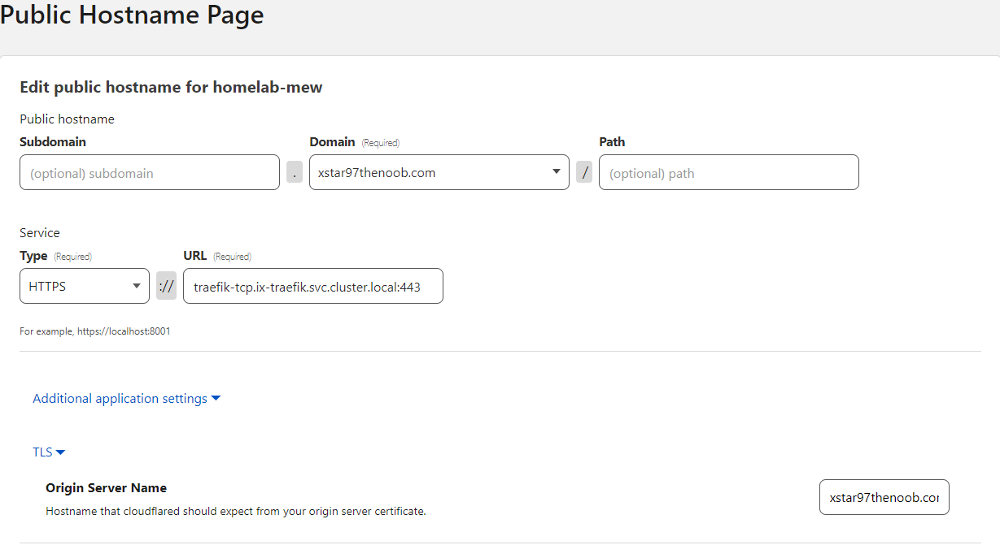
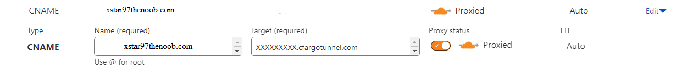
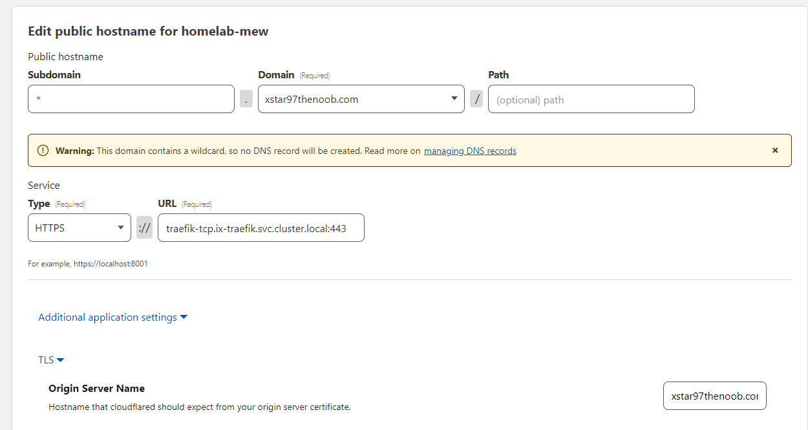
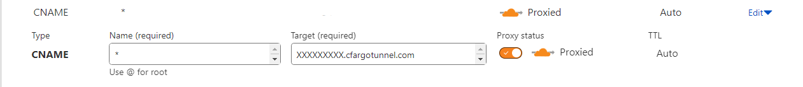

# CloudFlared & Traefik Guide

A guide to add traefik reverse proxy to a CloudFlared tunnel to expose apps with ingress.

:::caution

Implementing this guide will publicly expose your server, use at your own risk.

:::

Create a tunnel and install [cloudflared](https://truecharts.org/charts/stable/cloudflared/installation_notes) before starting this guide.

To add [**traefik**](https://truecharts.org/charts/enterprise/traefik/how-to#how-to) to the CloudFlared tunnel.

Create two public hostname entries in this order:

- The Root Domain
- The Wildcard Sub Domain

These are the values that would be needed and assumes that the app is named `traefik` and the port is set to `443`.

**type**: `https`

**url**: `traefik-tcp.ix-traefik.svc.cluster.local:443`

- **Additional application settings**
  - **TLS**
    - **Origin Server Name**: `mydomain.tld`

## The WildCard CNAME

:::note

When adding the sub hostname "**\***", it won't create the dns record automatically.

:::

Manually create a new CNAME record for `*` and then copy and paste the contents of the root domain's CNAME target value `XXXX..cfargotunnel.com` to the new DNS record.

## Traefik MiddleWares

It's highly advise to add a few MiddleWares like [ipwhitelist](/docs/platforms/scale/apps-and-services/apps/traefik/traefik-middlewares-guide/index.md#ipwhitelist) and [auth](/docs/platforms/scale/apps-and-services/apps/traefik/traefik-middlewares-guide/index.md#auth) to protect certain apps from being directly or indirectly exposed publicly.
