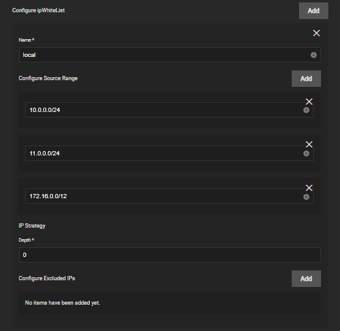
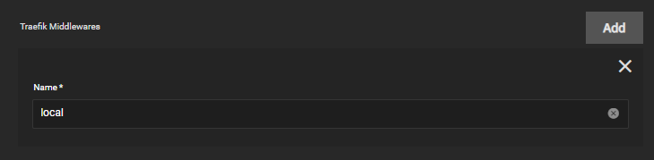

# Traefik Middlewares Guide

This guide will walk you through on on how to setup Traefik middlewares.

It's highly advise to add a few MiddleWares like `auth` and `ipWhiteList` to protect certain apps from being directly or indirectly exposed publicly.

## IpWhiteList

To make this work, you need to locally resolve your domain with a dns server.

Add your own lan range and the kubernetes `172.16.0.0/12` which encompasses the entire kubernetes range.

Edit the app you want to add this middleware and give it the same name, for example `local`.

## Auth

Adding an authentication middleware in Traefik can provide several benefits:

Security: It can protect sensitive information and resources by requiring users to provide valid credentials before accessing them.

User management: It can enable you to manage user accounts, define access rights, and restrict access to certain parts of your system.

Data protection: By controlling who can access certain data, you can help to ensure that it is kept confidential and secure.

Traceability: By tracking which users have accessed what resources, you can keep a record of who has done what, making it easier to understand how your system is being used.

Convenience: By using a centralized authentication system, you can reduce the amount of work required to implement authentication for each service, making it easier to manage and maintain.

Here's a non exhaustive list of various auth methods available.

- [Authelia](https://truecharts.org/charts/stable/lldap/authelia)
  - [lldap](https://truecharts.org/charts/stable/lldap/installation-notes)
- [Authentik](<https://truecharts.org/charts/stable/authentik/how_to>)
- [Organizr](<https://truecharts.org/charts/stable/organizr/forward_auth>)
- [Basic](<https://truecharts.org/charts/enterprise/traefik/traefik-basicAuth-middleware>)
