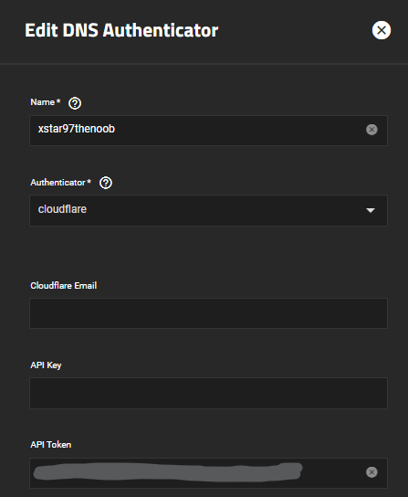
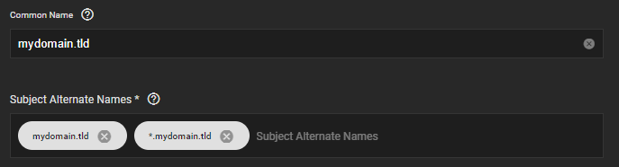
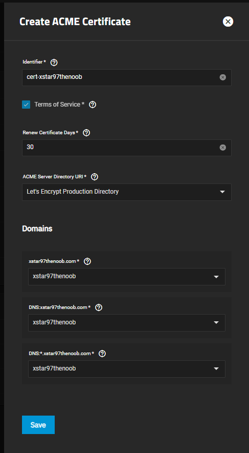
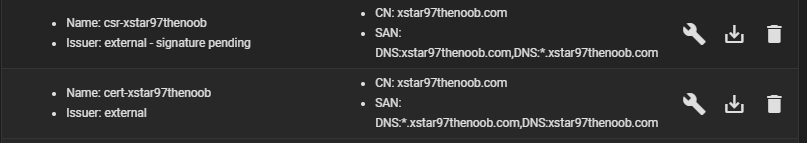
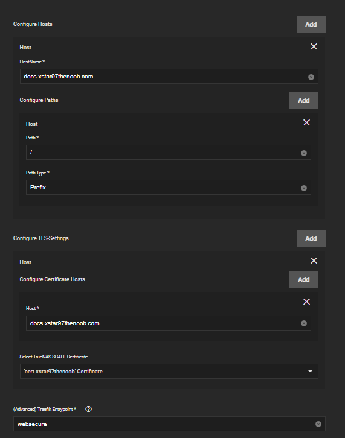

# Adding LetsEncrypt Certificates (Deprecated)

A guide to adding lets encrypt certificates to truenas scale.

:::note

Truecharts released cert-manager & clusterissuer, a better cert management system alternative, heres the [guide](https://truecharts.org/charts/enterprise/clusterissuer/how-to)

:::

Prerequisites:

- This guide **assumes** you will be using **Cloudflare**.
- Own a **real** domain(preferably CloudFlare)
  - If the domain is provided from another registrar, you can freely change the nameservers of your domain to CF and have it manage your domain.
  - for **Cloudflare API Tokens**, follow this [guide](/docs/misc/networking/cloudflare/api-token.md).
- Root/Admin user for scale should have an email setup prior to this task.
  - Edit the user in credentials -> local users and add an email.

## Truenas Scale

Go to Credentials -> Certificates page in Truenas Scale.

### ACME DNS Authenticators

Add the api token that you created for your domain in **ACME DNS-Authenticators**.

In my example I give this the same name as my root domain and add my token to **API Token**, all over sections can be ignored.

### Certificate Signing Requests

Add a CSR and give it a good name, I typically go with a name scheme like `csr-rootdomain`.

Skip **step 2** by leaving it default.

In **step 3** give exact details or fake it, upto you however the last section.

- Common Name should be the the root domain.
- Subject Alernate Names should either contain both root domain or wild card sub domain.
  - If you want to use both root domain and sub domain, just use both pictured below.
  - Otherwise the `*.mydomain.tld` would be sufficient of creating a universal cert for that domain.

Skip **step 4** as there's nothing to change.

Confirm and save.

:::note

Its normal for the CSR to display: `Issuer: external - signature pending`.

:::

To create the cert click the wrench icon on the CSR you just made.

Give it a name like `cert-rootdomain` and check the Terms of Service.

By default the Renew Certificate Days is set at a min of 10 days, optionally change it to 30 days.

Set the ACME **Server Directory URI\*** to `Let's Encrypt Production Directory`.

Finally add the ACME you created specifically for the domain.

Once save it will take a min to process but if done correctly you should see a shiny cert :).

## How to Use Certs and Ingress

- [traefik how to](https://truecharts.org/charts/enterprise/traefik/how-to)
- Enable ingress on any app that has the option for ingress.

Here's an example:

