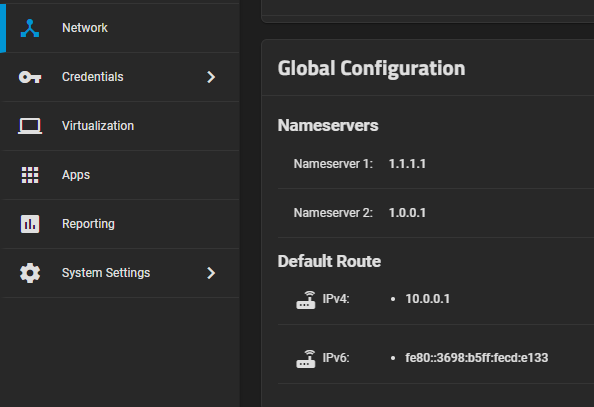
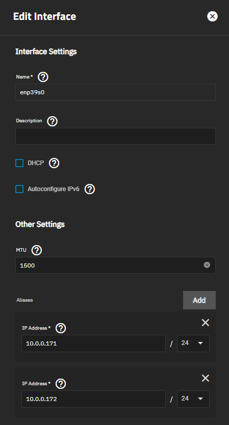
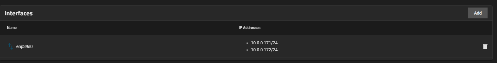
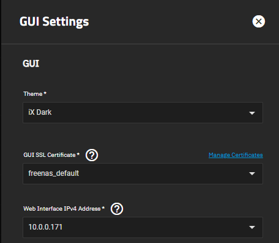
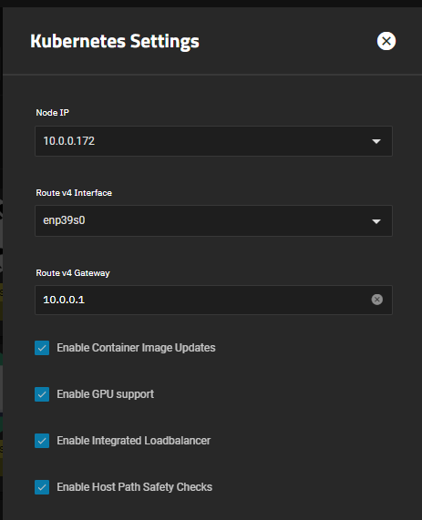

# Static IP Guide

This guide provides instructions for configuring static IP addresses and alias IPs.

:::note

If you've been experiencing issues with app installation or updates, following these steps can help resolve some of those problems. This is often a necessary step to ensure the stability of your Kubernetes setup for the Scale OS.

:::

## Network Global Configuration

1. Navigate to the "Networks" tab and edit the global configuration.

2. Remove all name server options and set Cloudflare DNS as the recommended choice.

   Ensure that you use external DNS exclusively here, and remove any LAN IP configurations.

   

### Network Interfaces

3. Edit your main network interface and perform the following actions:
   
   - Disable DHCP.
   - Disable IPv6.
   - Set your **own** custom alias IPs, typically set to 24 (default).

   

4. Create alias IPs as needed. For instance, you can have one for your web interface and another for apps only.

   

5. In "System Settings" -> "General" -> "GUI Settings," ensure your settings are correctly configured.

   

:::note

Alternatively, you can use [MetalLB](https://truecharts.org/charts/enterprise/metallb-config/setup-guide) if you prefer to assign individual IPs to all your apps.

:::

## Apps Settings

6. Navigate to "Apps" -> "App Settings" -> "Advanced."

7. Configure the following settings:
   
   - Set your nodeIP to the static IP from the drop-down list (alias IP).
   - Set your interface to your main network interface that corresponds to the alias IP.
   - Set your gateway to your own router's IP.

   

8. Save your settings and allow the apps to re-initialize.

## Validating the Changes

9. After implementing all the changes, wait a few minutes for your apps to come up, and then run the following command.

10. Go to "System Settings" -> "Shell," and execute the following command:

    ```shell
    sudo k3s kubectl get pods,svc -A
    ```

    Ensure that the pods do not report any errors, and the services display the correct IPs.
