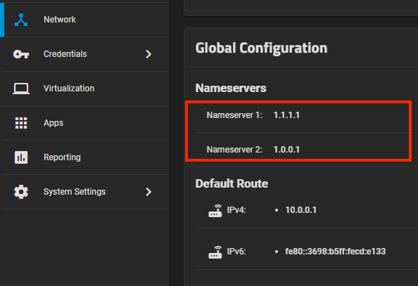

# Static IP Guide

A guide to set a static IP for scale and create alias IPs.

:::note

If you been experiencing any issues installing or updating apps, this may resolve some of those issues as this has been a necessary step to fix your kubernetes in scale.
:::

## Network Global Config

Go to networks tab and edit the global config.

remove all name server options and set cloudflare DNS (recommended)

only use external dns only here, remove _any_ lan ips.



### Network Interfaces

Edit your main interface and disable DHCP and IPv6.

Set alias IPs and set it to 24(default)


I have an alias IP for my web interface and another for apps only.


In system settings -> general -> GUI | settings.


:::note

You can just setup [metallb](https://truecharts.org/charts/enterprise/metallb-config/setup-guide) if you like all apps to have their own IPs.

:::

## Apps Settings

Go to apps -> apps settings -> advanced.

Set your nodeIP to the static IP from the drop down list(alias IP)
Set your interface to your main interface that matches that alias IP.
Set your gateway to your own router IP.


Save it and let the apps get re-init.

## Validate The Changes

After making all the changes, wait a few mins for your apps to come up and then run the following command.

Go to system settings -> Shell:

```shell
sudo k3s kubectl get pods,svc -A
```

The pods should not report any errors and the services should report the correct IPs.
