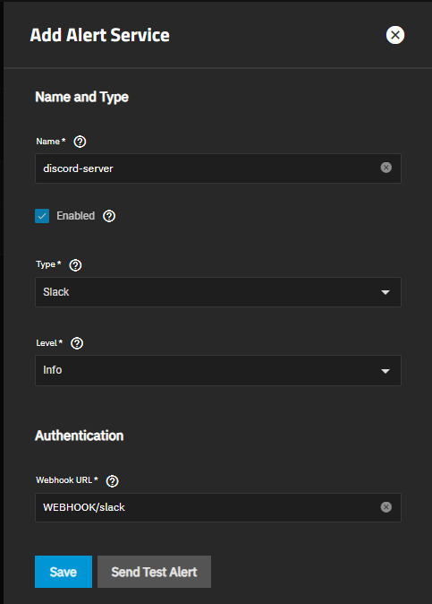
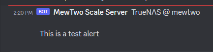
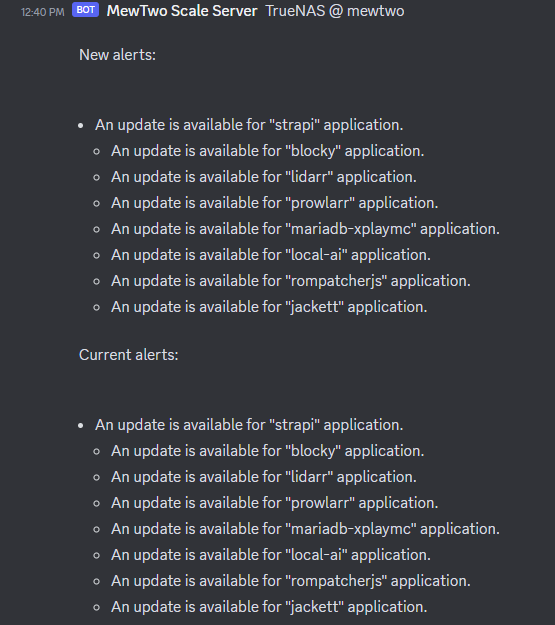

# Discord Alert Notifications

A guide on how to send TrueNAS Scale alerts to your private discord server.

:::note prerequisite

Need to setup a discord server and have a discord webhook from a notifications channel that you setup.

:::

First go to the alert service page; direct link here (please change it to the IP/port that you use or domain) -> http://truenas.local/ui/system/alert-settings.

1. Click the add button to add a service.
2. Select the **slack** option and fill out the info.
3. Add your discord webhook to **Webhook URL** and append to the url, **/slack**.

    

4. Test and save the service.

    

5. profit.

    
