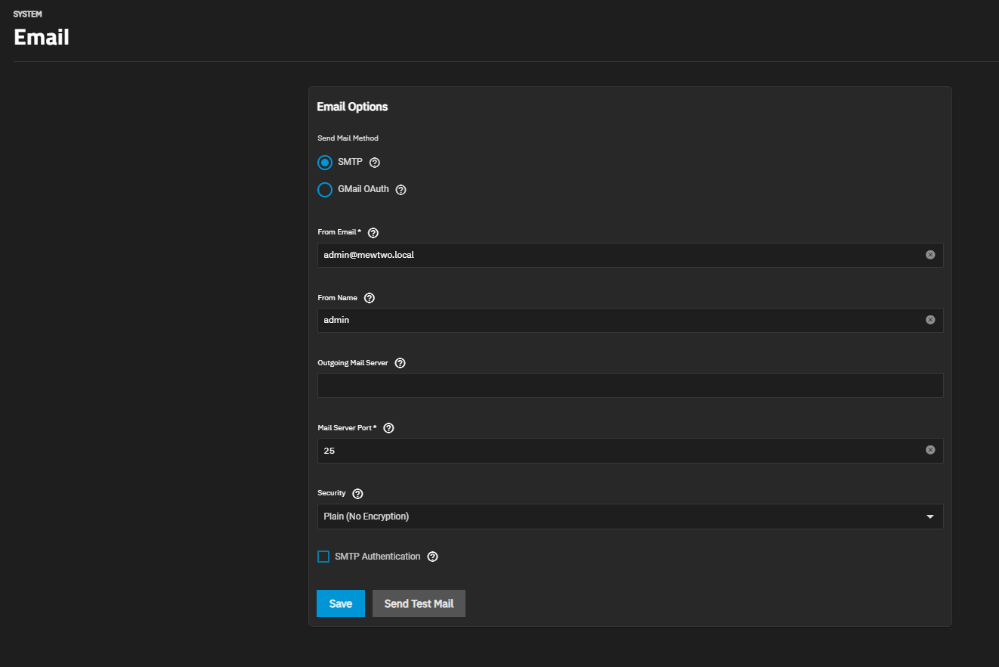
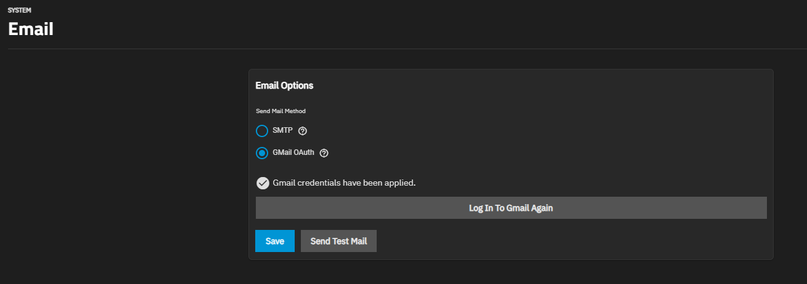
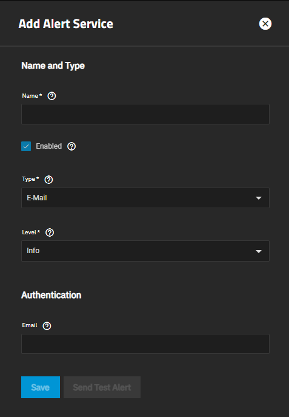

# Email Alert Notifications

A basic guide on how to send TrueNAS Scale alerts to your email.

## SMTP Service

Add your smtp service info here and test send an email.
    - Your root or admin user needs to have a valid email filled out or otherwise this will fail.

## Gmail Service

A simple solution; sign in with your gmail account.

## Add Email Service

Give the email service a name and set the email you want to have the alerts sent to.

